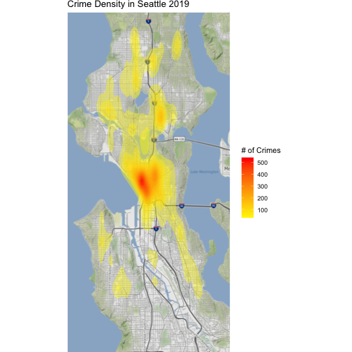

**Affiliation**: "INFO-201: Technical Foundations of Informatics - The Information School - University of Washington"

**Abstract** :  We are interested in identifying trends within crime rates in Seattle. This is an important topic to understand because it can ultimately be used to influence policy that makes our lives safer. To address this question, we will utilize data collected over the past decade regarding crime rates in Seattle.  

**Keywords** :  Seattle crime, Violent Crime, Property Crime, Income by Location, Crime rate and Income


# 1.0 Introduction 
Crime is an issue that many people deeply care about. Crime influences important issues such as our economy and political opinions. Crime rates can vary wildly between different neighborhoods within a city. As an example, downtown Seattle is known for having a higher rate of crime compared to the rest of the city. Our area of research for this project intends to dive deeply into crime data and understand trends that exist within that data. Additionally, we want to identify what kinds of correlations we can draw with crime from other data such as income rates. We will utilize two datasets containing crime and income data within Seattle neighborhoods over the past decade. Our goal is to capture meaningful information that Seattle politicians can utilize to make informed policy decisions that reduce crime in our city. We all would like to make Seattle a safer place to live.

# 2.0 Design Situation 
**Framing**: The topic of concern is crime in Seattle. There are multiple elements making this topic, namely: crime types, crime rates, areas of crime, income. Moreover, there are several questions to be asked about:
- Does *income* have a causal relationship with *crime rates*?
- What are the *factors* of a neighborhood in Seattle that affect *crime rate* in that area?
- What are the most prominent *types of crime* in Seattle?

**Human values**: Our project concerns with moral values categorized into these factors: *Personal-sexual*, *Social Trust*, *Legal-illegal*, *Self-interest*, which are the moral factors discussed in the article _MORAL VALUES, SOCIAL TRUST AND INEQUALITY: Can Values Explain Crime?_ [^1] In this study, general measures of moral values and tolerances have little to no relationships with the covariants of crime, but a sub-set of *Self-interest* items offer some explanations. *Self-interest* values directly associates with crime rates at national levels. Surprisingly, *Standard of Living* and *Social Trust* was not found to be responsible for crime rates, rather, they offered to be conditions for the variance of crime in difference settings.

**Stakeholders**: Our project is open to the public, therefore citizens, politicians, journalists, law practitioners get access to our data. These individuals then can help influence the policies and laws to make people' lives safer. Internally, the criminal justice system includes those who are responsible for enforcing and interpreting the law. Internal stakeholders of the criminal justice system could potentially include persons who are suspected of crimes and convicted. Externally, the media, groups that serve victims of crime, families, businesses, school and society can be impacted. [^3] People who consume media that use our project's
data can be influenced by the media' narratives. Similarly, people who are influenced by the politicians' and law practitioners' interpretations of our data can have a different viewpoint about these crimes and the elements surrounding them.

**Benefits and Harms**: In general, since these data about crimes are unbiased,
the public are expected to have an objective and more comprehensive view of the crimes, the income, and the direct stakeholders. Law enforcement can better make a case to acquire these resources needed to fight crime. [^2] Crime-fighting problems can be addressed to find solutions.
 On the other hand, direct stakeholders can misinterpret the data in order to spread mis/disinformation for unethical/selfish motives. Insufficient data could also cause data errors that shape the results in unintentional ways. Moreover, social media can have a bias view of this data, representing a false narrative of crime data. This following figure shows the difference between frequencies of different types of crimes against crime-related tweets. [^4]
 
# 3.0 Research Questions
Our questions revolve around identifying trends in crime rates within Seattle. The questions that we want to explore are:
 - What _types_ of crime are the most common in Seattle?
 - How have the crime rates _changed_ over the decade?
 - How does the crime rate _differ_ between neighborhoods within Seattle?
 - What _areas_ of Seattle have the highest crime rates?
 - What is the _relationship_ between income and crime rates in Seattle?  

We will address these questions by creating visualizations of crime rates over the different neighborhoods within the city. The answer to these questions will help us understand whether crime in Seattle is improving or getting worse. We can compare trends within different neighborhoods to identify which neighborhoods handle crime better than others. We want to see if a correlation exists between crime rates and income rates within Seattle.

# 4.0 The Dataset
The datasets that we chose to analyze are crime data in Seattle that ranges from 2008 to present and then data about Seattle's household income that has average household income by location from 2013 to 2019.
### Data set size and complexity
The data consists of 2 csv files with the crime data having 950,000 observations and 17 columns and the income data having 915 observations and 8 columns.
### Data Provenance
For both data sets the data being represented is based off of the population in King County for a given year. Observations in the crime data set are represented by a report number and broken down into the time the crime took place, location, and offense. The observations of the income data are broken down into year, average household income, and location. The crime data was collected and maintained by Seattle Police Department until May 2019 when the preservation and upkeep of the data moved to the National Incident-Based Reporting System (NIBRS). The main purpose of this data is to obviously keep track of crimes in Seattle for keeping records but also beneficial to understand more about crime in Seattle when it is represented in such a large dataset. This data benefits the people of Seattle and the United States as a whole because it represents how crime has evolved and changed in the last 14 years and allows us to determine if we are making a meaningful difference at combating crime and if not where we can improve. The income by location data we found is presented by DATAUSA but originated from the U.S. Ce nsus Bureau. The purpose of the income by location dataset is to understand how Seattle’s income has evolved over the years and also to compare different parts of Seattle. The data alone doesn’t necessarily benefit anyone in particular but is useful to understand the trend of our economy and shows how certain areas of Seattle are more expensive than others. Overall both of these datasets should be considered credible and trustworthy because they originate from government agencies.

# 5.0 Findings.  New section.  Given answers to each of your research questions (about 400 words or less).

# 6.0 Discussion.  New section. Discuss importance and/or implications of your findings (about 400 words).

# 7.0 Conclusion.  New section. Give the reader a summary point, the key point that you will like your audience to leave with (about 100 words or less).

# Summary Information:
Top 10 most committed crime groups in 2019

```
## # A tibble: 10 × 2
## # Groups:   Crime [10]
##    Crime                                    `Number of Crimes`
##    <chr>                                                 <int>
##  1 LARCENY-THEFT                                          9867
##  2 ASSAULT OFFENSES                                       4375
##  3 BURGLARY/BREAKING&ENTERING                             2947
##  4 DESTRUCTION/DAMAGE/VANDALISM OF PROPERTY               2306
##  5 TRESPASS OF REAL PROPERTY                              1603
##  6 MOTOR VEHICLE THEFT                                    1516
##  7 FRAUD OFFENSES                                         1468
##  8 DRUG/NARCOTIC OFFENSES                                  688
##  9 ROBBERY                                                 591
## 10 DRIVING UNDER THE INFLUENCE                             548
```


Most committed crime groups in 2019: 

```
## [1] "LARCENY-THEFT"
```

Least committed crime group in 2019: 

```
## [1] "DRUNKENNESS"
```

Census tract with the highest household income by race in 2019: 

```
## [1] "Census Tract 62, King County, WA"
```

Highest household income by race in 2019:

```
## [1] 208636
```

Census tract with the lowest household income by race in 2019: 

```
## [1] "Census Tract 53.02, King County, WA"
```

Least household income by race in 2019:

```
## [1] 17188
```

In our study of the data, we found some interesting statistics about crime data in Seattle in 2019, the latest recorded year. The most prevalent crime in Seattle in 2019 is LARCENY-THEFT, which is in common with many studies about crime data in the United States [^5][^6]. Moreover, the census tract with the highest household income by race in 2019 is Census Tract 62, King County, WA, align with the Montlake/Portage Bay MCPP. Interestingly, the census tract with the lowest household income by race in 2019 is Census Tract 53.02, King County, WA, align with the University MCPP, which is the University of Washington area. 

# Aggregate Table:

|crime                                       | Montlake/Portage Bay| University|
|:-------------------------------------------|--------------------:|----------:|
|All Other Larceny                           |                   23|        119|
|Burglary/Breaking & Entering                |                   22|        162|
|Counterfeiting/Forgery                      |                    2|          5|
|Credit Card/Automated Teller Machine Fraud  |                    4|         28|
|Destruction/Damage/Vandalism of Property    |                   15|        120|
|Driving Under the Influence                 |                    2|          6|
|Extortion/Blackmail                         |                    1|          4|
|False Pretenses/Swindle/Confidence Game     |                    1|         14|
|Family Offenses, Nonviolent                 |                    1|          3|
|Fondling                                    |                    1|         NA|
|Identity Theft                              |                    4|          6|
|Intimidation                                |                    2|         48|
|Motor Vehicle Theft                         |                    4|         52|
|Shoplifting                                 |                    1|         97|
|Simple Assault                              |                    7|         92|
|Theft From Building                         |                    5|         43|
|Theft From Motor Vehicle                    |                   42|        188|
|Theft of Motor Vehicle Parts or Accessories |                    6|         14|
|Trespass of Real Property                   |                    5|         65|
|Wire Fraud                                  |                    2|          3|

The table concerns with the comparison of crimes committed in between the Montlake/Portage Bay MCPP and the University MCPP, the highest income by location census tract and the lowest. There is a substantial difference between them, with the University MCPP has a much higher number of crimes committed in every category. This points to a potential causal relationship between crime rate and income by location, but more data needs to be examined before coming to such conclusion.

# Charts:

#### Chart 1 : Top 10 Crime Groups


This chart represents the number of crimes in King County and displays the 10 biggest categories for each type of crime. The purpose of this graph is to get a better understanding of what type of crimes happen the most in the greater Seattle area. I think the most notable observation is Larceny-Theft being the largest with over 200,000 crimes happening from the years 2013-2019. I think the most surprising piece of data was assault offenses being the second highest committed crime.

#### Chart 2 : Crime Density in Seattle 2019




This heat map represents the number of crimes in the Seattle area in 2019. We can see that the crime levels are a lot higher in the more central city areas of Seattle compared to the outer areas of Seattle. This could be due to many factors like high homeless levels, higher gang activity, higher poverty rates, and/or more growing population. This type of information can be important when it come down to choosing where to live or being more aware of the area if you live or  plan on visiting these more central areas. 

#### Chart 3 : Crimes Density vs. Median Income in Seattle 2019


This chart represents the correlation between income and number of crimes in 2019 for each area in Seattle. Each data point represents a single latitude and longitude value rounded to 2 decimal places, which means an area of approximately 1 km^2. This graph shows that there is a negative correlation between income and number of crimes for both property and violent crimes. We can use this information to validate that the areas with higher income have less crime on average. Using the income rate map from the previous section, we can find the safest places to live. We can also see that property crime appears 10x more than violent crime at a rate of 100 crimes per 1km^2 vs the 10 crimes per 1km^2 for violent crime.

## References

[^1]: [Halpern, D. (2001). MORAL VALUES, SOCIAL TRUST AND INEQUALITY: Can Values Explain Crime? The British Journal of Criminology, 41(2), 236–251.]( http://www.jstor.org/stable/23638820) .

[^2]: [The benefits of criminal justice data: Beyond policing](https://sunlightfoundation.com/2015/05/01/the-benefits-of-criminal-justice-data-beyond-policing/) .

[^3]: [Identifying Criminal Justice Stakeholders](https://study.com/academy/lesson/identifying-criminal-justice-stakeholders.html#:~:text=Internal%20stakeholders%20include%20police%20officers,court%20personnel%2C%20and%20other%20individuals.) .

[^4]: [Prieto Curiel, R., Cresci, S., Muntean, C.I. et al. Crime and its fear in social media. Palgrave Commun 6, 57 (2020). ](https://doi.org/10.1057/s41599-020-0430-7)

[^5]: [Topic: Property crime in the U.S. Statista. Retrieved February 21, 2022](https://www.statista.com/topics/1751/property-crime-in-the-us/#topicHeader__wrapper)  

[^6]: [What are the most common crimes in the United States? Criminal Justice Degree Hub. (2015, May 24). Retrieved February 21, 2022](https://www.criminaljusticedegreehub.com/what-are-the-most-common-crimes-in-the-united-states) 
